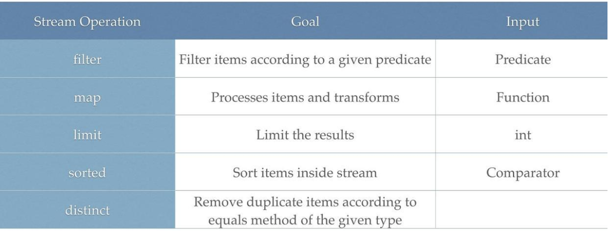
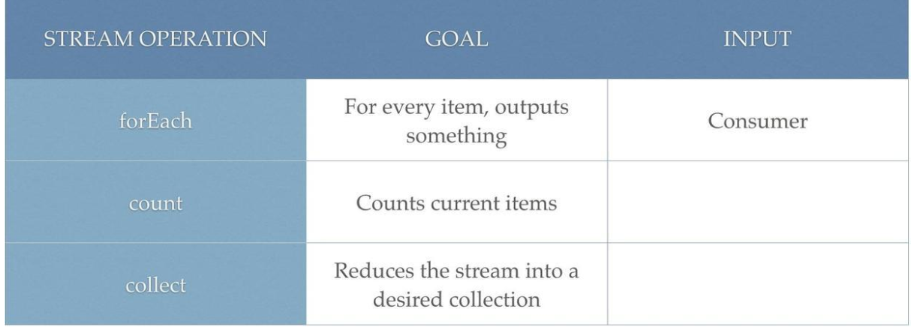

### Java SE


#### Stream API

[ref](https://zhuanlan.zhihu.com/p/59230509)

**Stream创建**：

- 集合增加Stream方法
- Stream.of

```java
Stream<String> stream = Stream.of("Hollis", "HollisChuang", "hollis", "Hello", "HelloWorld", "Hollis");
```

- 数组使用 `Arrays.stream()`，基础数据类型的Stream转换为集合需要先使用`boxed()`


**Stream常见操作**：



reduce


**Stream最终操作**：




`toList()`

`toMap()`

`toSet()`