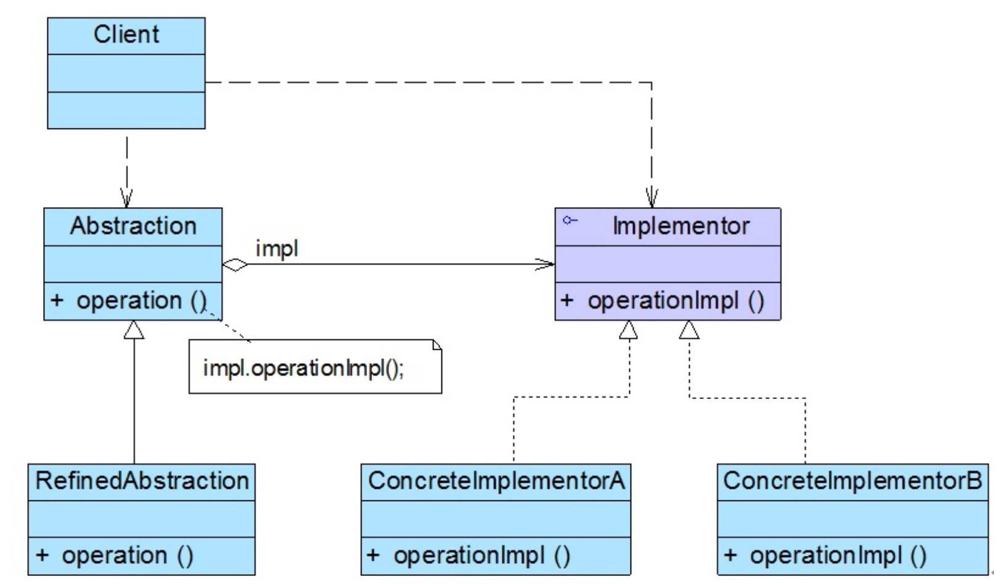
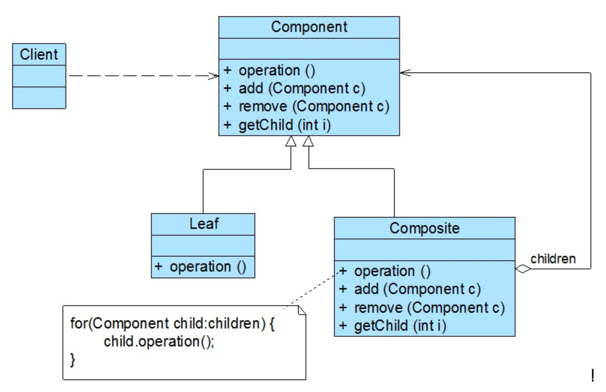
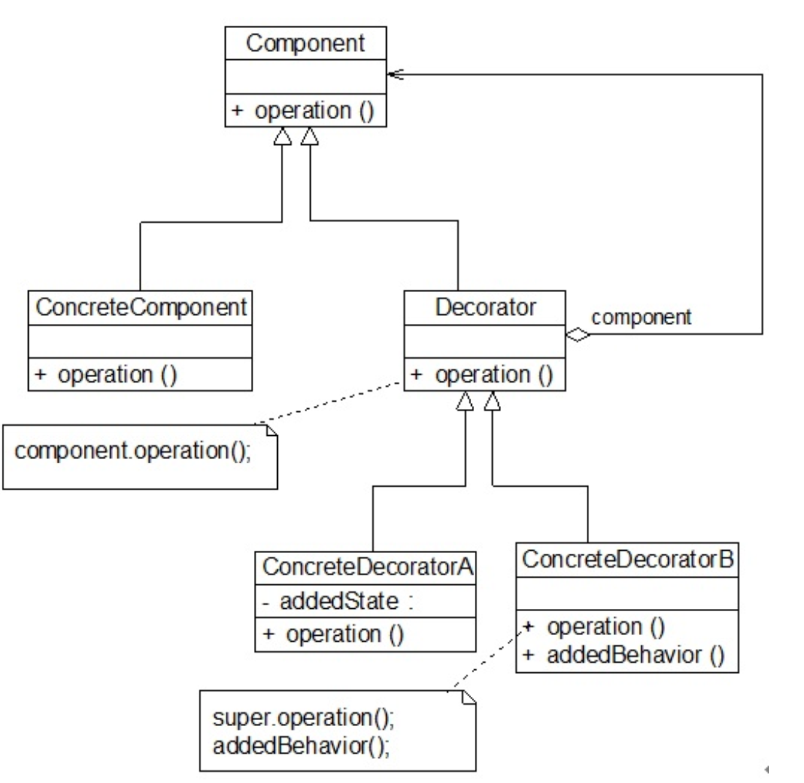
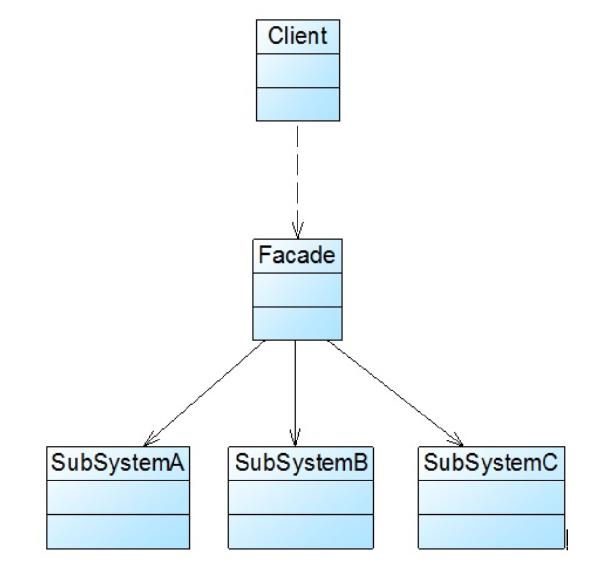
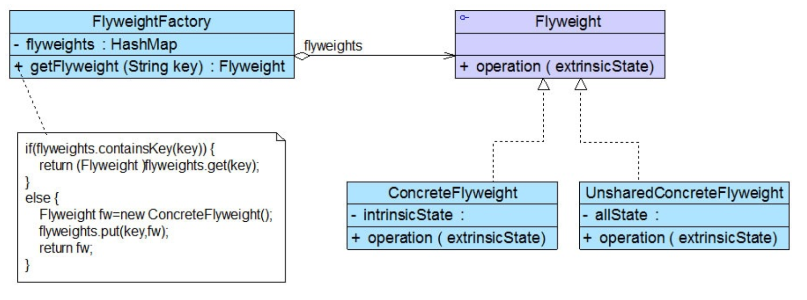
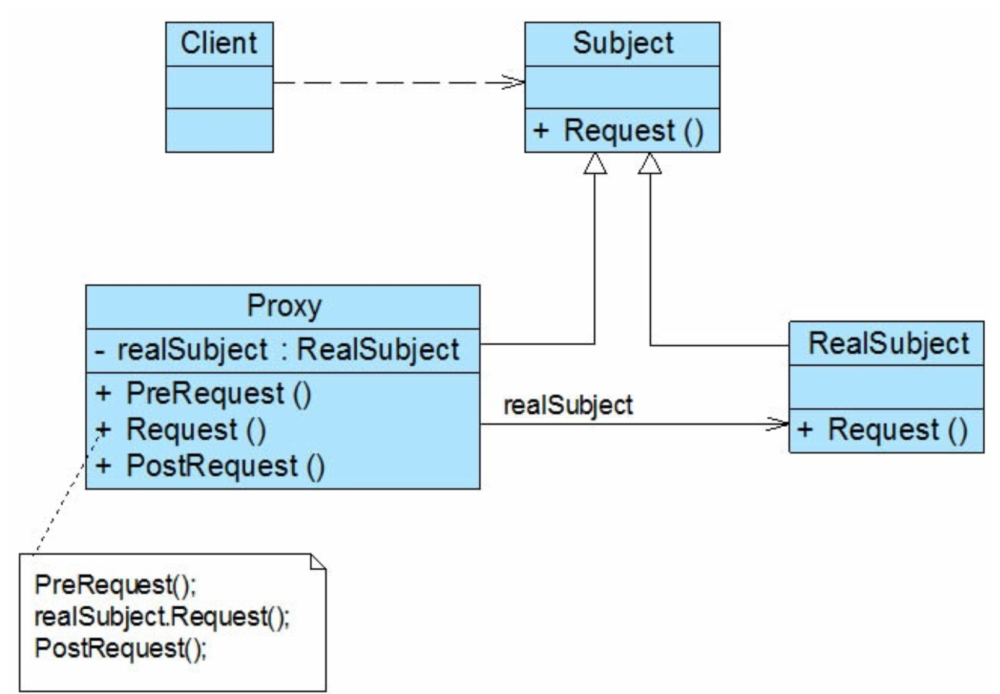

# 《Java设计模式》阅读笔记


## 一、面向对象设计原则

**1、单一职责**

一个类只完成一项工作

**2、开闭原则**

对扩展开放，对修改关闭

**3、里氏代换原则**

所有引用基类的地方必须能透明地使用子类

**4、依赖导致原则**

针对接口编程，而不是针对实现编程，传递参数或者关联关系中，尽量使用高层次的抽象，而具体的实现类则通过配置文件指定

**5、接口隔离原则**

使用多个专门的接口，而不使用单一的总接口，接口不能太大（违反接口隔离原则），接口也不能太小（接口泛滥）

**6、合成复用原则**

尽量使用对象的组合，而不是对象的继承来达到目的

组合/聚合手段能够降低类之间的耦合度，使系统更加灵活

**7、迪米特原则**

一个软件实体应当尽可能少的与其他实体发生相互作用

通过引入一个第三者来降低耦合度

## 二、六个创建型模式

### 简单工厂模式

步骤：

1. 将不同具体的产品封装到不同的类，将公共代码抽取封装到抽象产品类
2. 提供一个工厂类用于创建不同的产品，提供一个工厂方法根据不同的输入参数创建不同的产品对象


工厂类中用于创建对象的方法为静态方法，所以也称作静态工厂

静态工厂方法中的三种角色：

**工厂、抽象产品、具体产品**

```java
abstract class Product {
    public abstract void methodDiff();
    public void methodSame(){};
}

class ConcreteProduct extends Product {
    public void methodDiff(){};
}

class ProductFactory {
    public Static Product getProduct(String arg) {
        if (arg.equals("")) {
            
        } else if (arg.equals("")) {
            
        }
    }
}
```


客户端通常在创建对象时将输入参数写入properties文件


为了简化上述方式，通常也可将工厂方法写入抽象类中


**简单工厂的一个大问题：当需要扩展新产品的时候，会修改工厂类，违反开闭原则**


### 工厂方法模式

步骤：

1. 通过一个抽象工厂接口来声明抽象工厂方法
2. 子类具体实现相关工厂方法，创建具体的产品类

工厂方法中的**角色**：

抽象产品，具体产品，抽象工厂，具体工厂


实际使用中，具体工厂也可以完成一些对象初始化与资源环境配置工作，例如连接数据库


工厂方法模式的问题：会引入大量的类


### 抽象工厂模式

一个工厂提供多个相关的对象

**产品等级结构**：产品的继承结构，例如 电视机-海尔电视机

**产品族**：同一工厂生产，位于不同产品等级结构中的产品，例如 海尔电视机与海尔电冰箱


抽象工厂模式适用于工厂生产位于多个不同产品结构，属于不同类型的多个产品对象。与工厂方法的区别，工厂方法针对单一的产品结构，而抽象工厂针对于多个产品等级结构，**每一个具体工厂生产一个产品族的产品**


抽象工厂中的角色：

抽象产品，具体产品，抽象工厂，具体工厂


抽象工厂的问题：

增加新的产品族很方便，但是增加新的产品等级结构很困难（修改工厂类代码，客户端代码，不符合开闭原则）


### 单例模式

一个类只有一个实例，自行实例化并向系统提供这个实例

三个要点：静态工厂方法；构造函数私有；唯一静态对象


饿汉模式：静态对象直接初始化，在类加载的时间已经完成单一对象初始化，不会出现不一致的情况

懒汉模式：第一次调用工厂方法时创建（Lazy Load）通常`synchronized`加锁

Iodh模式：创建一个私有的静态内部类，内部类成员为待创建对象


### 原型模式

定义：使用原型实例指定对象种类，并且拷贝这些原型创建新的对象

原型模式中的角色：

抽象原型类，具体原型类，客户类


两种方法：

1、通用clone方法：创建对象，设置属性

2、Java的clone()方法：实现Cloneable接口


浅克隆与深克隆：是否支持对引用类型的成员变量的复制

`Object.clone()`方法时浅克隆，可通过序列化、反序列化实现深克隆


### 建造者模式

定义：将复杂对象的创建与它的表示分开，使得同样的构建过程可以创造不同的表示

建造者模式中的角色：

抽象建造者，具体建造者，产品角色，指挥者


- 指挥者角色可以省略，在抽象建造者中增加`construct()`方法，但是当建造过程很复杂时一般不这样做

- 添加钩子方法，`isXXX()`，在建造实例的时候判断某一部件是否建造


## 三、七个结构型模式

### 适配器模式

定义：将一个接口转换成客户希望的另一个接口， 使接口不兼容的那些类可以一起工作  

适配器模式中的角色：

目标抽象类，适配器类，适配者类


**类适配器**：适配器与适配者之间为继承关系。**对象适配器**：适配器与适配者之间为关联关系。

一般很少使用类适配器（Java为单继承）


### 桥接模式

定义：将抽象部分与它的实现部分分离， 使它们都可以独立地变化  

桥接模式中的角色：抽象类，扩充抽象类，实现类接口，具体实现类。其中，抽象类与实现类是关联关系



一般抽象类中的实现类接口定义为protected


### 组合模式

定义：组合多个对象形成树形结构以表示具有“整体—部分”关系的层次结构，在组合模式中，对单个对象（叶子）与组合对象（容器）的使用具有一致性

组合模式中的角色：抽象组件，叶子构件，容器构件




根据抽象类定义形式，可分为透明组合模式以及安全组合模式

**透明组合模式**：抽象构建类中声明了所有用于管理成员对象的方法，包括add，remove等

**安全组合模式**：抽象构建类中未声明用于管理成员对象的方法，由容器类管理实现，这样客户端不能完全针对抽象编程


### 装饰模式

定义：动态地给一个类增加一些额外的职责

装饰模式中的角色：

抽象构件`Component`，具体构件`ConcreteComponent`，抽象装饰类`Decorator`，具体装饰类`ConcreteDecorator`




具体构件类和装饰类都实现了相同的抽象构件接口 ，所以装饰模式对客户端来说是透明的


**透明装饰模式**：客户端完全针对抽象层编程，客户端程序不应该将对象声明为具体构件类型或具体装饰类型  

**半透明装饰模式**：有时需要单独调用新增的业务方法  


### 外观模式

定义：为子系统中的一组接口提供一个统一的入口。 外观模式定义了一个高层接口， 这个接口使得这一子系统更加容易使用  

外观模式中的角色：外观角色`Facade`，子系统角色`Subsystem`




**抽象外观类**：客户端针对抽象外观类编程，这样一些外观类或子系统的变化对客户端可能是透明的，客户端可以通过配置文件选择具体的外观类


### 享元模式

定义：运用共享技术有效地支持大量细粒度对象的复用。一般结合工厂模式一起使用

享元模式中的角色：抽象享元类`Flyweight`，具体享元类`ConcreteFlyweight`，非共享具体享元类`UnsharedConcreteFlyweight`，享元工厂类`FlyweightFactory`。通常结合单例模式来创建具体享元类，享元池一般是存储享元对象的一个键值对集合



内部状态通常作为享元类的成员对象，而外部状态多通过注入方式


外部状态：需要的时候再进行设置


单纯享元模式：所有的具体享元类都是可以共享的

复合享元模式：复合享元类`CompositeConcreteFlyweight`中的多个享元对象具有相同的外部状态


### 代理模式

定义：给一个对象提供一个代理或是占位符，由代理对象控制对原对象的访问

代理模式中的角色：抽象主题`Subject`，代理主题`Proxy`，真实主题`RealSubject`

